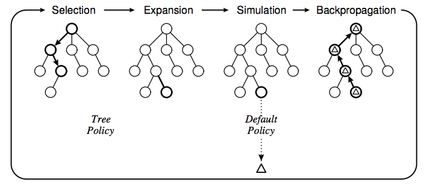
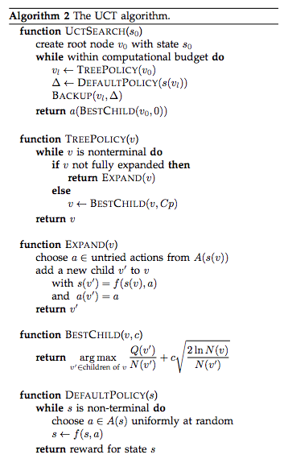
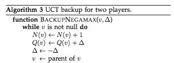
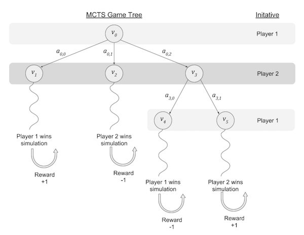

# Monte Carlo Tree Search

- Monte Carlo Tree Search is an alternative to Minimax search that has been used successfully in many modern applications. 
- MCTS is a general search technique that can be trivially extended to adversarial search. 
- The main benefit of MCTS vs Minimax is that it is an aheuristic search — no need a good search heuristic in the domain to get reasonable results.
- It works better than minimax in extremely large domains (E.g. Go agents — including AlphaGo and AlphaZero—use MCTS).

# How it Works

MCTS works by combining tree search with simulation; 
- Rather than using a heuristic to estimate the value of each leaf node of the search tree, it instead quickly simulates the remaining game according to some default policy, and uses many replications of those rollouts to estimate the value of each possible action. 
- The MCTS algorithm includes four phases: Selection, Expansion, Simulation, and Backpropagation. 
- Pseudocode for each phase is shown below, along with the backup step for 2-player games.

It is possible to perform MCTS with uniform sampling of the action space, but that tends to be inefficient in terms of sampling. 
- Upper Confidence Bound for Trees (UCT) is an alternative sampling strategy that tries to sample more promising actions more frequently than other actions. 
- It has been shown that MCTS converges to the minimax value of a search tree as the number of simulations goes towards infinity.

# The MCTS Reward Function

- The reward function in MCTS does not rely on a heuristic, but the semantics of the reward can be confusing. 
- In the formulation presented in the pseudocode above, the default policy should return **+1** if the agent holding initiative at the start of a simulation loses and **-1** if the active agent when the simulation starts *wins* because nodes store the reward relative to their parent in the game tree.

#### **But...why?**

The BestChild() function chooses the action _a_ that maximizes _Q_ over the child nodes _v'_ of the input node _v_, so the value of Q should be higher if taking action _a_ from state _v_ will lead to the player with initiative in state _v_ (the parent) winning from state _v'_ (the child), and lower if taking the action will lead to a loss.

The figure above illustrates the simplest representation of the four possible cases for new node expansion.

- Starting from v=v0, search may expand action a0,0 to reach v1, where the simulation results in a win for player 1. Notice that player 2 has initiative on the board when the simulation is performed, so the utility of the final state to the active player in state v1 (i.e., player 2) is -∞, however the MCTS reward should be +1 because player 1 benefits from choosing action a0,0.

- Starting from v=v0, search may expand action a0,1 to reach v2, where the simulation results in a win for player 2. The utility of the final simulation state to the active player in state v2 (i.e., player 2) is ∞, however the MCTS reward should be -1 in order to discourage Player 1 from choosing action a0,1.

- Starting from v=v0, search may expand action a0,2 to reach v3, then expands action a3,0 to reach v4 where the simulation results in a win for player 1. The utility of the final simulation state to the active player in the initial simulation state v4 (i.e., player 1) is ∞, however the MCTS reward should be -1 in order to discourage Player 2 (the parent of v4) from choosing action a3,0; the BackupNegamax() function inverts the reward before propagating back to v3 which makes Player 1 more likely to choose action a3,0—which makes sense because the simulation on this branch led to a win for Player 1.

- Starting from v=v0, search may expand action a0,2 to reach v3, then expands action a3,1 to reach v5 where the simulation results in a win for player 2. The utility of the final simulation state to the active player in the initial simulation state v4 (i.e., player 1) is -∞, however the MCTS reward should be 1 in order to encourage Player 2 (the parent of v5) to choosing action a3,1; the BackupNegamax() function inverts the reward before propagating back to v3 which makes Player 1 less likely to choose action a3,0—which makes sense because the simulation on this branch led to a loss for Player 1.
