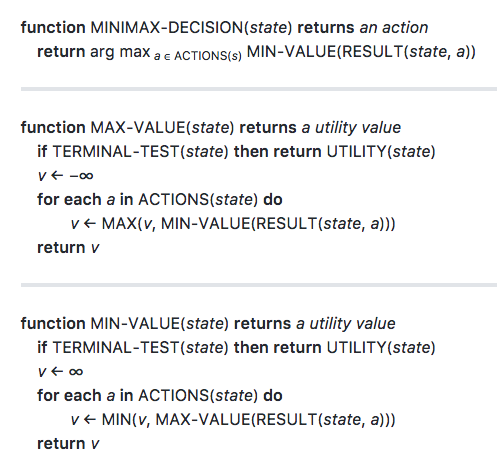

# **MiniMax Search**


### **Encoding isolation gameboard**

```python

# Representing the Game State  for the mini-Isolation game 
# that meet the three requirements specified

# Game Class Requirements
# The game state object needs to enforce all of the rules of the game, and represent all of the 
# information describing a single configuration of the game at a specific point in time. 

# Isolation GameState class needs properties that can:
# - keep track of which cells are open and closed
# - identify which player has initiative (whose turn it is to move)
# - track the current position each player on the board

from copy import deepcopy

call_counter = 0

class GameState:
    """
    Attributes
    ----------
    _board: list(list)
        Represent the board with a 2d array _board[x][y]
        where open spaces are 0 and closed spaces are 1
    
    _parity: bool
        Keep track of active player initiative (which 
        player has control to move) where 0 indicates that
        player one has initiative and 1 indicates player 2
    
    _player_locations: list(tuple)
        Keep track of the current location of each player
        on the board where position is encoded by the
        board indices of their last move, e.g., [(0, 0), (1, 0)]
        means player 1 is at (0, 0) and player 2 is at (1, 0)
    """

    def __init__(self, xlim=3, ylim=2):
        """The GameState class constructor performs required
        initializations when an instance is created. The class
        should:
        
        1) Keep track of which cells are open/closed
        2) Identify which player has initiative
        3) Record the current location of each player
        
        Parameters
        ----------
        self:
            instance methods automatically take "self" as an
            argument in python
        xlim:
            board dimension x
        ylim:
            board dimension y
        Returns
        -------
        None
        """
        self.MOVES = [(1, 0), (1, -1), (0, -1), (-1, -1),
                      (-1, 0), (-1, 1), (0, 1), (1, 1)]
        self._xlim = xlim
        self._ylim = ylim
        self._board = [[0] * ylim for _ in range(xlim)]
        self._board[-1][-1] = 1
        self._player = 0
        self._player_locations = [None, None]

    def player(self):
        return self._player

    def actions(self):
        """ Return a list of legal actions for the active player         
        You are free to choose any convention to represent actions,
        but one option is to represent actions by the (row, column)
        of the endpoint for the token. For example, if your token is
        in (0, 0), and your opponent is in (1, 0) then the legal
        actions could be encoded as (0, 1) and (0, 2).
        """
        actions = self.liberties(self._player_locations[self._player])
        return actions

    def result(self, action):
        """ Return a new state that results from applying the given
        action in the current state
        """
        assert action in self.actions(), "Attempted to plan an illegal move"
        new_board = deepcopy(self)
        new_board._board[action[0]][action[1]] = 1
        new_board._player_locations[self._player] = action
        new_board._player ^= 1
        return new_board

    def terminal_test(self):
        """ return True if the current state is terminal,
        and False otherwise
        
        Hint: an Isolation state is terminal if _either_
        player has no remaining liberties (even if the
        player is not active in the current state)
        """
        global call_counter
        call_counter += 1
        
        terminated = (not self._has_liberties(self._player) or  
                      not self._has_liberties(1-self._player))
        return terminated

    def utility(self, player_id):
        """ return +inf if the game is terminal and the
        specified player wins, return -inf if the game
        is terminal and the specified player loses, and
        return 0 if the game is not terminal
        """
        if not self.terminal_test(): return 0
        player_id_is_active = (player_id == self.player())
        player_has_liberties = self._has_liberties(self.player())
        active_player_wins = (player_has_liberties == player_id_is_active)
        return float("inf") if active_player_wins else float("-inf")

    def liberties(self, loc):
        """ Return a list of all open cells in the
        neighborhood of the specified location.  The list 
        should include all open spaces in a straight line
        along any row, column or diagonal from the current
        position. (Tokens CANNOT move through obstacles
        or blocked squares in queens Isolation.)
        """
        if loc is None: 
            return self._get_blank_spaces()
        moves = []
        for dx, dy in self.MOVES: # check each move direction
            _x, _y = loc
            while 0 <= _x + dx < self._xlim and 0 <= _y + dy < self._ylim:
                _x, _y = _x + dx, _y + dy
                if self._board[_x][_y]: # found blocked cell
                    break
                moves.append((_x, _y))
        return moves

    def _has_liberties(self, player_id):
        """ Check to see if the specified player has any liberties """
        return any(self.liberties(self._player_locations[player_id]))

    def _get_blank_spaces(self):
        """ Return a list of blank spaces on the board."""
        blanks = [(x, y) for y in range(self._ylim) for x in range(self._xlim) if not self._board[x][y] ]
        return blanks

if __name__ == "__main__":
    # This code is only executed if "gameagent.py" is the run
    # as a script (i.e., it is not run if "gameagent.py" is
    # imported as a module)
    emptyState = GameState()  # create an instance of the object

```


### **Algorithm**



### **Depth limited search**

```python
def minimax_decision(gameState, depth):
    """ Return the move along a branch of the game tree that
    has the best possible value.
    """
    best_score = float("-inf")
    best_move = None    
    for a in gameState.actions():
        v = min_value(gameState.result(a), depth - 1)
        if v > best_score:
            best_score = v
            best_move = a
    return best_move

def min_value(gameState, depth):
    """ Return the value for a win (+1) if game is over,
    otherwise return the minimum value over all legal child
    nodes.
    """
    if gameState.terminal_test():
        return gameState.utility(0)
        
    if depth == 0:
        return 0

    v = float("inf")
    for a in gameState.actions():
        v = min(v, max_value(gameState.result(a), depth-1))
    return v

def max_value(gameState, depth):
    """ Return the value for a loss (-1) if the game is over,
    otherwise return the maximum value over all legal child
    nodes.
    """
    if gameState.terminal_test():
        return gameState.utility(0)
    
    if depth == 0:
        return 0
    
    v = float("-inf")
    for a in gameState.actions():
        v = max(v, min_value(gameState.result(a), -1))
    return v
```

### Adding an Evaluation Function

- Earlier implementation of depth limited search assumed that the value of any state where search cut off was zero
  - But we don't know without finishing the search that those states have a value of zero 

- In fact, for the isolation game, they do not have a value of zero because there are no ties
  - so every state is either a win or a loss for the current player

- We can improve the performance of depth limited search using the concept of an "evaluation function" (also called a heuristic function), which is like "intuition" for the search procedure about which moves are likely to result in wins or losses.

```python

# DO NOT MODIFY THE PLAYER ID
player_id = 0

def my_moves(gameState):
    loc = gameState._player_locations[player_id]
    return len(gameState.liberties(loc))


def minimax_decision(gameState, depth):
    """ Return the move along a branch of the game tree that
    has the best possible value.  A move is a pair of coordinates
    in (column, row) order corresponding to a legal move for
    the searching player.
    
    You can ignore the special case of calling this function
    from a terminal state.
    """
    best_score = float("-inf")
    best_move = None
    for a in gameState.actions():
        # call has been updated with a depth limit
        v = min_value(gameState.result(a), depth - 1)
        if v > best_score:
            best_score = v
            best_move = a
    return best_move


def min_value(gameState, depth):
    """ Return the value for a win (+1) if the game is over,
    otherwise return the minimum value over all legal child
    nodes.
    """
    if gameState.terminal_test():
        return gameState.utility(0)
    
    if depth <= 0:
        return my_moves(gameState)
    
    v = float("inf")
    for a in gameState.actions():
        # the depth should be decremented by 1 on each call
        v = min(v, max_value(gameState.result(a), depth - 1))
    return v


def max_value(gameState, depth):
    """ Return the value for a loss (-1) if the game is over,
    otherwise return the maximum value over all legal child
    nodes.
    """
    if gameState.terminal_test():
        return gameState.utility(0)
    
    if depth <= 0:
        return my_moves(gameState)
    
    v = float("-inf")
    for a in gameState.actions():
        # the depth should be decremented by 1 on each call
        v = max(v, min_value(gameState.result(a), depth - 1))
    return v
```
